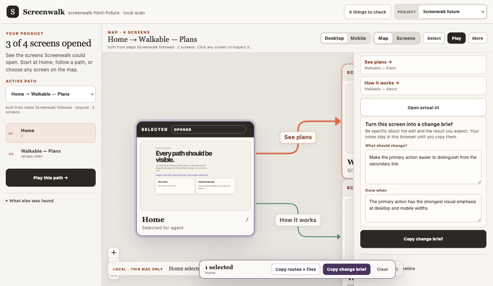

<div class="product-proof">
  
  <p>The included synthetic fixture, mapped from localhost: actual screens, entry-reachable paths, an unproven route, and a change brief in one workspace.</p>
</div>

## Your product has outgrown your mental model

AI can add a route faster than you can remember it exists. A redesign can leave an old screen reachable. An auth wall can hide the experience you meant to review. A green build—or an agent saying “it works”—does not prove the UI rendered. A route list tells you files exist; it does not show the product people can actually move through.

Screenwalk turns repository evidence and a running local app into one reviewable map.

<div class="truth-grid">
  <div class="truth-card"><strong>Inventory</strong><span>See every discovered route and visual state, including code-only and unconnected screens.</span></div>
  <div class="truth-card"><strong>Experience</strong><span>Follow entry-reachable branches and play captured paths without tab-spelunking.</span></div>
  <div class="truth-card"><strong>Action</strong><span>Copy findings, routes, source files, and capture context back to your coding agent.</span></div>
</div>

## The shortest path to a useful map

Keep your app running, then point Screenwalk at its repository and local URL:

```bash
npx screenwalk /absolute/path/to/app --url http://127.0.0.1:3000
```

Screenwalk scans, captures, starts its local Studio, and opens the map in your browser. It does not upload your application or replace its dev server.

[Run the five-minute quickstart →](/guide/quickstart)

::: info Public beta
Screenwalk is available from npm as a public beta. The command runs locally and writes its evidence into the current project's `.screenwalk/` directory. See [beta expectations](/beta) before sharing sensitive captures.
:::
